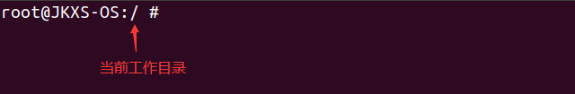
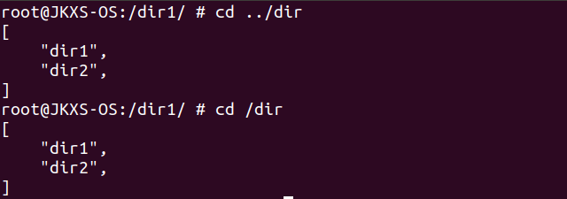

# User_shell

## cd支持

对于shell的外建命令，通常是文件系统中的某个可执行文件，执行外建命令时，需要shell先fork出一个子进程，在通过exec执行该命令。内建命令则是shell进程本身执行的命令，并不会创建新进程，而cd正是shell众多内建命令之一。



如上图所示，我们在shell中存储了当前的工作目录以进行打印，而shell进程本身工作目录的切换则是通过系统调用 `chdir`来实现，根据 `chdir`的返回值，在shell中打印相应错误信息或者更改并打印当前存储的工作目录。


## 简单tab补全支持

### get_wordlist()函数实现

我们实现了一个类 `getdents64`的系统调用，它获取的是给定绝对路径的目录下的目录项（通过绝对路径也是为了后续使用的方便），而不是给定文件描述符对应目录下的目录项。当然，获取到并存储在buffer的仍然是 `struct linux_dirent`，其结构如下：

```c
struct linux_dirent {
    unsigned long  d_ino;     /* Inode number */
    unsigned long  d_off;     /* Offset to next linux_dirent */
    unsigned short d_reclen;  /* Length of this linux_dirent */
    char           d_name[];  /* Filename (null-terminated) */
    char           pad;       // Zero padding byte
    char           d_type;    // File type
}
```

当然我们需要使用到的信息只有其中的 `d_name`，因此我们在用户库中对该系统调用进行了进一步封装，提取并保存buffer中每一个 `struct linux dirent`的 `d_name`，最终返回一个 `Vec<String>`。其函数签名如下：

```rust
fn get_wordlist(abs_path: &str) -> Vec<String>
```

含义就是通过绝对路径，获取对应目录下的目录项，作为补全词表(wordlist)。

### 当前工作目录下的tab补全

当前工作目录下的tab补全较为简单，因为我们在shell中已经保存了当前的工作目录，所以只需要将当前工作目录传入 `get_wordlist()`就可以获取到当前工作目录下的补全词表，暂且称之为 `cwd_wl`。其中需要调用 `get_wordlist()`的情况如下：

* 进入user_shell时，置当前的工作目录为根目录，通过 `get_wordlist()`获取根目录下的补全词表。
* 在user_shell中每按一次回车即执行用户命令时（前提条件当然是存在命令且命令有效），由于可能会执行 `mkdir`、`rm`等命令导致当前工作目录下的目录项被修改，所以需要重新获取补全词表。当然并不是所有的命令都会修改目录项，但简便起见我们还是在每一次执行用户命令后都重新获取了一遍。
* cd后由于切换了当前工作目录，因此也需要重新获取补全词表。

获取到补全词表后，tab补全实现的主要流程如下：

1. user_shell捕获到用户输入TAB键后，对当前的命令行输入以空格进行拆分，获取其中的最后一项记为 `space_word`。如果 `space_word`不为空，则进行下一步。
2. 如果 `search_sub_flag`为 `true`，则置 `sub_wl`为在 `sub_wl`中找到的所有以 `space_word`为首的补全词；如果 `search_sub_flag `为 `false`，则置 `sub_wl`为在 `cwd_wl`中找到的所有以 `space_word `为首的补全词，并置 `search_sub_flag`为 `true`。其中 `search_sub_flag`是加快搜索速度的设计，对部分较长的目录项名，可能需要多次tab才能够补全，而除了第一次补全需要在补全词全集上进行搜索外，后续的补全都可以只在前一次获得的补全词子集中搜索。但需要注意的是，以下情况 `search_sub_flag`需要置为 `false`：
   - 进入user_shell，初始化 `search_sub_flag`时
   - 在user_shell中每按一次回车键、退格键、空格键时
3. 如果 `sub_wl`为空，说明没有可供补全的补全词，进行下一次捕获用户输入的循环，否则进行下一步。
4. 找 `sub_wl`中补全词的最长公共前缀，如果与 `space_word`相等，则展示 `sub_wl`以提示用户下一步输入；如果不相等，则补全为该最长公共前缀。

### 其他目录下的tab补全



如上图所示，虽然我们当前所在的工作目录为 `/dir1`，但需要补全的却是 `/`下的内容，这就涉及到了其他目录下的tab补全。其主要流程与当前工作目录下的tab补全流程类似，主要是在第1、2步中间加入以下流程：

1. 获取到 `space_word`后，将 `space_word`按照 `/`进行拆分，获取其中的最后一项记为 `slash_word`。如果 `slash_word`不为空，则进行下一步（注意“**当前工作目录下的tab补全**”中第1步中不需要判断 `space_word`是否为空了）。
2. 判断 `space_word`和 `slash_word`是否相等，如果相等，则说明不需要其他目录下的tab补全，直接进行当前工作目录下的tab补全即可。如果不相等，则说明需要其他目录下的tab补全（暂且称该目录为补全目录），进行下一步。
3. 移除 `space_word`中最后一个 `/`之后的内容，则会获得补全目录的绝对路径或者当前工作目录到补全目录的相对路径（取决于 `space_word`是否以 `/`为首）。
4. 判断 `space_word`是否以 `/`为首，如果是，则补全目录的绝对路径已经得到；如果不是，则利用user_shell `cd`时更改当前工作目录的方法，我们也很容易通过相对路径得到补全目录的绝对路径。
5. 得到补全目录的绝对路径后，通过 `get_wordlist()`获得补全目录下的补全词表，记为 `sub_wl`，置 `search_sub_flag`为 `true`。
6. 有了 `sub_wl`，且 `search_sub_flag`为 `true`后，就可以衔接到“**当前工作目录下的tab补全**”的第2步了，后续只需要将步骤中的 `space_word`改成 `slash_word`即可。
